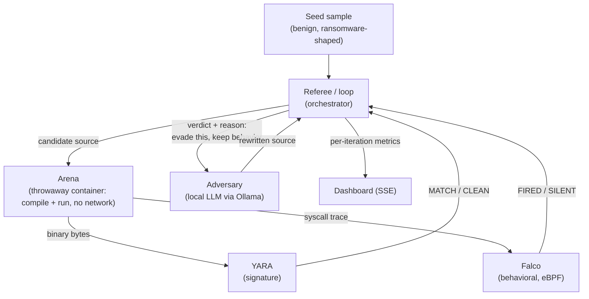

# Hydra

> Kill one signature, it grows a new head.


**An adversarial evasion lab.** A local, security-tuned LLM rewrites a benign,
ransomware-shaped program in a closed loop, trying to slip past two real
detectors — **YARA** (signature) and **Falco** (behavioral, eBPF) — reacting to
each detector's feedback. Hydra measures how each holds up. The result is a
number, not a scripted reveal: **the signature detector is evaded in a single
iteration; the behavioral detector is never evaded while the sample still behaves
like ransomware.**

The question it answers: *when the adversary is an LLM that adapts to a
detector's feedback, which kind of detection survives — signature, or behavior?*
This matters now because field malware (Google's PromptFlux/PromptLock, 2025) has
started using LLMs to rewrite itself and reason about *why* it was caught.

## ⚠️ Safety & ethics

This is **authorized, defensive detector-robustness research** — a benign sample,
against Hydra's *own* lab detectors, offline, to show why behavioral detection is
stronger. It is **not** a tool for evading third-party defenses.

- The sample is **benign by construction**: it only rewrites throwaway files it
  creates in its own sandbox, does no network or persistence, and reverses its
  own "encryption" before exiting.
- Mutated code runs **only inside a throwaway, network-isolated container**.
- **Real malware is never executed** — it is used only for optional static rule
  validation, in isolation.
- Everything runs offline on one machine. No sample or telemetry leaves it.

Full threat model and limits: [ARCHITECTURE.md](ARCHITECTURE.md) §3, §6.

## How it works



The referee is the only stateful control point. The arena is disposable. The
adversary sees the detector's verdict *and reason* each round and rewrites the
sample to evade it while preserving behavior — the adaptation step a template
mutator cannot do, because it has to *reason about why it was detected*.

## Results

From a representative run (`results.json`, generated by `make run`):

| Metric | Result |
| --- | --- |
| Iterations to evade the **signature** rule (YARA) | **1** |
| Behavioral evasions **while behavior was preserved** (Falco) | **0** |
| Was breaking the malicious behavior *required* to evade Falco? | **Yes** |

The signature rule dies fast — changing bytes is easy. The behavioral rule only
goes silent when the sample stops rewriting files with high-entropy content, i.e.
stops being ransomware. **The takeaway: against an adaptive AI adversary,
signatures are brittle and behavior is robust, because evading behavior requires
abandoning the behavior.** 📊 See the [live results dashboard](https://asrar-ali.github.io/Hydra/).

## Quickstart

Runs today with a **fake arena** — the whole loop, no container, model, or
detector required (standard library only):

```bash
git clone https://github.com/Asrar-ali/Hydra.git && cd Hydra
make run        # HYDRA_FAKE=1 — runs the loop, writes results.json, self-checks
make test       # unit tests (stdlib unittest, no deps)
make dashboard  # http://localhost:8000/  ->  ▶ Run
```

For the real pipeline: `make setup` (installs YARA, pulls the model), then
`make arena-build`, then run without `HYDRA_FAKE`. The default adversary model is
`mistral:7b` — fast (~30s/iteration) and reliably clears the signature rule in
one iteration.

### Two payload modes

- **metamorphic** (default) — the LLM rewrites one C program between builds,
  reacting to detector feedback each time. `make run`
- **promptlock** — modeled on the PromptLock ransomware (ESET, Aug 2025): the LLM
  writes a brand-new Python script every run, no feedback loop. `make run-promptlock`

Same story either way: the signature rule dies, the behavioral rule doesn't.

## Tech stack

**Python** · **YARA** (signature detection) · **Falco / eBPF** (behavioral
detection) · **Ollama** (local LLM adversary) · **Docker** (throwaway sandbox) ·
server-sent-events dashboard, standard-library only for the core loop.

## Layout

```
common/     shared contracts, config, logging, entropy
sample/     seed.c / seed_promptlock.py — the benign sample
arena/      throwaway-container compile/run + capture
detectors/  yara (signature) + falco (behavioral) + rules
adversary/  llm.py (Ollama) + mutator.py (deterministic fallback)
referee/    loop.py + gate.py — the loop and the metrics
ui/         index.html — SSE dashboard
tests/      unit tests
```

Everything talks through the contracts in `common/contracts.py`, so components
can be built against the fake arena and wired to the real tools independently.
See [ARCHITECTURE.md](ARCHITECTURE.md) for the full design.

## License

MIT — see [LICENSE](LICENSE).
